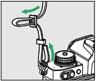
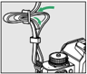
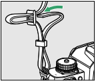
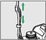
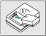
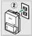
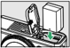

<!-- page 1 -->

## 开始步骤

## 安装挂带

安装挂带（附送或另购的挂带）的步骤如下：

<!-- page 2 -->

## 电池充电

请在使用前为附送的 EN-EL25 电池充电。

## D 电池与充电器

- ･ 请阅读并遵循 ' 安全须知 ' （ 0 33 ）和 ' 照相机和电池的 保养：注意事项 ' （ 0 656 ）中的警告和注意事项。
- ･ 若要使用 EN-EL25a ，照相机的固件版本必须为 C: 1.50 或更高版本（ 0 480 ）。

## 使用充电器充电

请使用 MH-32 充电器为电池充电。

- ･ 请将充电器插入家用插座进行充电。在某些国家 或地区，可能会随附连接有适配器的充电器。充 电指示灯在充电时闪烁，并在充电完成时点亮。
- ･ 电池充满电所需的时间约为 2 小时 40 分钟（使用 EN-EL25a 时）或 2 小时 30 分钟（使用 EN-EL25 时） （针对电量耗尽的电池）。

<!-- page 3 -->

## D 若 CHARGE （充电）指示灯快速闪烁

若 CHARGE 指示灯快速闪烁（每秒 8 次）：

- ･ 发生电池充电错误 ：断开充电器的电源，然后取出并 重新插入电池。
- ･ 周围温度太高或太低 ：在指定温度范围（ 0-40 ℃）内 使用充电器。

若问题仍然存在，请断开充电器的电源结束充电。将电 池和充电器送至尼康售后服务网点。

## 使用电源适配器（另购）充电

在照相机中插有电池时，可将照相机连接至另购的 EH-8P 电源适配器为电池充电。

## 1 将 EN-EL25 插入照相机（ 0 95 ）。

