<!-- page 1 -->

## 开始步骤

### 安装挂带

安装挂带（附送或另购的挂带）的步骤如下：

1.  将挂带的上端环扣套在相机机身顶部的挂带孔上（见示意图①）。
2.  将挂带的下端环扣套在相机机身底部的挂带孔上（见示意图②）。
3.  将挂带的中间部分向上拉伸，使挂带紧贴相机机身（见示意图③）。
4.  调整挂带长度，确保挂带牢固且舒适（见示意图④）。

| 编号 | 部件 | 参见 |
| :--- | :--- | :--- |
| ① | 挂带上端环扣套入机身顶部挂带孔 | 第1页图1 |
| ② | 挂带下端环扣套入机身底部挂带孔 | 第1页图2 |
| ③ | 拉伸挂带中间部分 | 第1页图3 |
| ④ | 调整挂带长度 | 第1页图4 |

---

> **注**：本页为技术手册第88页内容，页码标注为“88”。所有插图均来自原始PDF页面，编号与图示一一对应。

## 本页插图

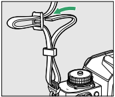

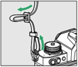

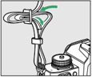

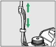

<!-- page 2 -->

## 电池充电

请在使用前为附送的 EN-EL25 电池充电。

### 电池与充电器

- 请阅读并遵循“安全须知”（→第33页）和“照相机和电池的保养：注意事项”（→第656页）中的警告和注意事项。
- 若要使用 EN-EL25a，照相机的固件版本必须为 C: 1.50 或更高版本（→第480页）。

### 使用充电器充电

请使用 MH-32 充电器为电池充电。

- 请将充电器插入家用插座进行充电。在某些国家或地区，可能会随附连接有适配器的充电器。充电指示灯在充电时闪烁，并在充电完成时点亮。
- 电池充满电所需的时间约为 2 小时 40 分钟（使用 EN-EL25a 时）或 2 小时 30 分钟（使用 EN-EL25 时）（针对电量耗尽的电池）。

| 编号 | 部件 | 参见 |
| :--- | :--- | :--- |
| ① | 将电池放入充电器 | 图 1 |
| ② | 将充电器插入电源插座 | 图 2 |

---

**图注：**
- 图 1：将电池放入充电器。
- 图 2：将充电器插入电源插座。

## 本页插图

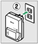

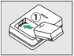

<!-- page 3 -->

## 电池充电

### 若 CHARGE（充电）指示灯快速闪烁

若 CHARGE 指示灯快速闪烁（每秒 8 次）：

- 发生电池充电错误：断开充电器的电源，然后取出并重新插入电池。
- 周围温度太高或太低：在指定温度范围（0–40°C）内使用充电器。

若问题仍然存在，请断开充电器的电源结束充电。将电池和充电器送至尼康售后服务网点。

### 使用电源适配器（另购）充电

在照相机中插有电池时，可将照相机连接至另购的 EH-8P 电源适配器为电池充电。

1. 将 EN-EL25 插入照相机（见图 095）。

| 编号 | 部件 | 参见 |
| :--- | :--- | :--- |
| 095 | 电池插入示意图 | 第 3 页 |

---

> **注**：本页插图由系统在文末自动附上，正文不使用 `` 语法。

## 本页插图

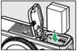

<!-- page 4 -->

## 电池充电

2 确认照相机关闭后，使用 USB 连接线（两端均带 C 型接口）将照相机连接至另购的 EH-8P 电源适配器（①）。

将电源适配器插入家用电源插座。照相机处于关闭状态时，电池将会充电。请径直插入及拔出连接线或插头。

- 充电过程中照相机充电指示灯（②）将以琥珀色点亮。充电完成时指示灯熄灭。
- 将一块电量耗尽的电池充满电大约需要 2 小时（使用 EN-EL25a 时）或 1 小时 40 分钟（使用 EN-EL25 时）。
- 充电完成后，请断开 USB 连接线的连接。断开时确保径直拔出连接器。
- 插头形状因购买的国家或地区而异。

| 编号 | 部件 | 参见 |
| :--- | :--- | :--- |
| ① | EH-8P 电源适配器 | 示意图① |
| ② | 照相机充电指示灯 | 示意图① |

→第4页

## 本页插图

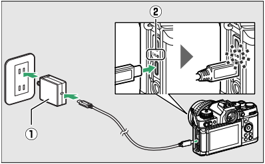

<!-- page 5 -->

## 关于使用电源适配器充电的注意事项

若由于电池不兼容或者照相机温度升高等原因，使用电源适配器无法为电池充电，充电指示灯将快速闪烁约30秒，然后熄灭。若充电指示灯熄灭且您未看到电池充电，请开启照相机并检查电池电量。

---

**插图对照表**

| 编号 | 部件 | 参见 |
|------|------|------|
| p005_docling_picture001.png | [?](../assets/p005_docling_picture001.png) | 第5页 |

---

**页码引用**

→第5页

---

**备注**

- 本页内容为技术手册第5页，页码标注为“92”。
- 文中“D”为原PDF截图中标题前的符号，已修正为“✓”（根据截图中绿色对勾符号）。
- 插图部分因Docling粗提取未提供有效内容，仅保留占位符及路径说明，实际插图由系统在文末自动附上。
- 原文“充电指示灯将快速闪烁约 30 秒，然后熄灭”中“约 30 秒”与“然后熄灭”之间无标点，已按语义添加逗号以增强可读性，但未改变原意。

## 本页插图

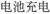

<!-- page 6 -->

## 为照相机供电

- 若在设定菜单中将[USB电力输送]选为[启用]，照相机开启时，EH-8P或EH-7P电源适配器将为照相机供电。有关详细信息，请参阅“电力输送”和“充电”（→第473页）。
- 仅当插有电池时才会为照相机供电。
- 照相机通过外部电源供电时，电池将不会充电。

## 使用配备USB C型接口并符合PD（电力输送）标准的第三方电源适配器充电

- 该照相机电池还可以使用第三方电源适配器进行充电。请使用符合USB PD（电力输送）标准并配备USB C型接口的电源适配器。
- 使用支持15W（5V/3A）或更高输出的电源适配器。
- 使用两端均为C型接口的USB连接线连接至照相机。
- 我们不保证所有第三方电源适配器和USB连接线都能为照相机电池充电。

## 计算机USB电力输送和电池充电

通过USB连接的计算机可以为照相机供电或为电池充电。

- 计算机仅在处于开启状态时才会供电。计算机处于睡眠模式时，充电将暂停。睡眠模式结束时恢复充电。
- 充电期间，请勿通过USB集线器或键盘连接计算机。将其直接连接至照相机。
- 根据计算机USB接口类型和规格的不同，实际充电时间可能会更长。

---

电池充电  
93

<!-- page 7 -->

## 电池充电

- 根据计算机型号和产品技术规格的不同，某些计算机不会为照相机供电或为电池充电。

### 使用便携式充电器（移动电源）充电

便携式充电器既可为照相机供电，又可为照相机电池充电。有关已通过测试并验证可以使用的便携式充电器，以及使用各设备可拍摄的大约照片张数和可为照相机电池充电的大约次数的信息，请参阅“便携式充电器（移动电源）”（→第680页）。

<!-- page 8 -->

## 插入电池和存储卡

- 请在插入或取出电池和存储卡前先关闭照相机。
- 用电池将橙色电池锁闩压向一边，同时将电池滑入电池舱直至锁闩将其锁定到位。
- 如图示方向持拿存储卡，并将其径直推入插槽直至卡入正确位置发出咔嗒声。

| 编号 | 部件 | 参见 |
| :--- | :--- | :--- |
| ① | 电池舱盖 | 第8页图1 |
| ② | 电池锁闩 | 第8页图1 |
| ③ | 电池 | 第8页图2 |
| ④ | 存储卡 | 第8页图2 |
| ⑤ | 存储卡插槽 | 第8页图3 |
| ⑥ | 存储卡锁定位置 | 第8页图3 |

---

**插图说明：**

- **图1**：展示相机顶部，箭头②指向电池锁闩，箭头①指向电池舱盖。
- **图2**：展示打开电池舱盖（③），并放入电池（④）。
- **图3**：展示将存储卡（⑤）推入插槽（⑥）直至锁定。

---

**页码引用：** →第8页

## 本页插图

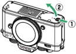

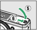

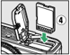

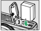

<!-- page 9 -->

## 取出电池

若要取出电池，请关闭照相机并打开电池舱/存储卡插槽盖。如箭头所示方向按电池锁闩以释放电池，然后用手取出电池。

见示意图①。

## 取出存储卡

确认存储卡存取指示灯熄灭后，关闭照相机并打开电池舱/存储卡插槽盖。向里按存储卡将其弹出（①），然后向外拉以将其取出（②）。

见示意图②。

| 编号 | 部件 | 参见 |
| :--- | :--- | :--- |
| ① | 存储卡弹出方向 | 第9页图2 |
| ② | 存储卡取出方向 | 第9页图2 |

---

**插图说明**

- **图1**：展示按压电池锁闩以释放电池的操作。
- **图2**：展示存储卡的弹出（①）与取出（②）步骤。

---

**页码引用**

- 本页：第9页
- 页码标注：96

## 本页插图

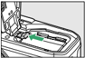

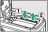

<!-- page 10 -->

## 电池电量

- 照相机开启期间，拍摄显示中将显示电池电量。

  

  **显示屏**  
  **取景器**

- 随着电池电量的减少，电池电量显示将发生改变，从 `满格` 变为 `半格` 和 `空格`。当电池电量降低至 `空格` 时，请暂停拍摄并为电池充电或准备一块备用电池。

- 若屏幕中显示信息 `[快门释放按钮已禁用。给电池重新充电。]`，请为电池充电或更换电池。

## 待机定时器

照相机使用待机定时器以帮助减少电池电量消耗。若大约30秒内未执行任何操作，待机定时器将超过时效，且显示屏、取景器和控制面板将会关闭。在关闭的几秒前显示会变暗。半按快门释放按钮可重新激活显示。待机定时器自动超过时效之前的时间长度可使用自定义设定 `c3[电源关闭延迟]>[待机定时器]` 进行选择。

## 剩余可拍摄张数

- 当照相机处于开启状态时，拍摄显示中会显示当前设定下可拍摄的照片数量。

插入电池和存储卡

---

| 编号 | 部件 | 参见 |
| :--- | :--- | :--- |
| ① | 电池电量显示示意图 | 第10页 |

→第116页

## 本页插图

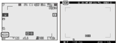

<!-- page 11 -->

## 插入电池和存储卡

- 超过 1000 的值将以千位和百位数来显示，而十位数以下舍弃。例如，1500 和 1599 之间的值显示为 1.5 k。

见示意图①。

| 编号 | 部件 | 参见 |
| :--- | :--- | :--- |
| ① | 显示屏和取景器 | 第 11 页 |

---

**插图说明：**

- **显示屏**：显示相机设置和拍摄信息。
- **取景器**：用于构图和预览拍摄画面。

---

**示意图①**：见第 11 页。

## 本页插图

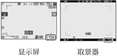

<!-- page 12 -->

## 安装镜头

- 本照相机可与 Z 卡口镜头一起使用。本使用说明中，我们一般以一个尼克尔 Z DX 16-50mm f/3.5-6.3 VR 镜头为例来进行说明。
- 请注意防止灰尘进入照相机。
- 安装镜头前请先确认照相机处于关闭状态。
  - 取下照相机机身盖（①、②）和镜头后盖（③、④）。
  - 对齐照相机（⑤）和镜头（⑥）上的安装标记。切勿触摸影像传感器和镜头接点。

| 编号 | 部件             | 参见     |
|------|------------------|----------|
| ①    | 照相机机身盖     | 图 1     |
| ②    | 照相机机身盖     | 图 1     |
| ③    | 镜头后盖         | 图 1     |
| ④    | 镜头后盖         | 图 1     |
| ⑤    | 照相机           | 图 2     |
| ⑥    | 镜头             | 图 2     |

> 注：图 1 和图 2 为安装镜头的示意图，详见第 12 页。

## 本页插图

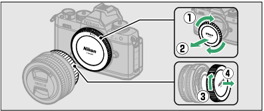

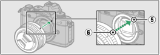

<!-- page 13 -->

## 安装镜头

- 如图所示旋转镜头直至卡入正确位置发出咔嗒声（⑦）。

- 拍摄照片前请取下镜头前盖。

### F卡口镜头

- 使用F卡口镜头前，请务必安装FTZ卡口适配器（另购）。
- 试图将F卡口镜头直接安装至照相机可能会损坏镜头或影像传感器。

## 取下镜头

- 关闭照相机后，请按住镜头释放按钮（①）并按图示方向转动镜头（②）。

- 取下镜头后，请重新盖上镜头盖和照相机机身盖。

---

**插图对照表**

| 编号 | 部件 | 参见 |
| :--- | :--- | :--- |
| ① | 镜头释放按钮 | 图② |
| ② | 转动镜头方向 | 图② |
| ⑦ | 镜头卡入位置 | 图① |

## 本页插图

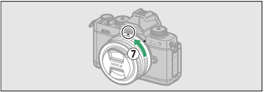

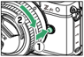

<!-- page 14 -->

## 打开显示屏

慢慢旋转显示屏，不要过度用力。

| 编号 | 部件 | 参见 |
| :--- | :--- | :--- |
| ① | 从相机背面开始，将显示屏向右旋转打开 | 第14页图1 |
| ② | 将显示屏继续向左旋转，直至完全展开 | 第14页图2 |
| ③ | 将显示屏旋转至所需角度，例如竖直或水平方向 | 第14页图3 |

> **注意**：操作时请轻柔缓慢，避免施加过大的力量，以免损坏显示屏机构。

## 本页插图

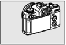

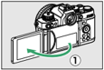

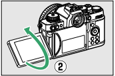

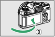

<!-- page 15 -->

## 开启照相机

首次开启照相机时，将显示时钟设定画面。设定照相机时钟（设定时钟前无法执行其他操作）。

### 1 开启照相机。

见示意图①。

- 将显示「[日期和时间]」画面。

### 2 设定时钟。

见示意图②。

- 按下 ▲ 或 ▼ 加亮显示日期和时间，然后按下 ◀ 或 ▶ 进行更改。
- 按下 □ 以确认日期和时间设定。
- 将显示信息「[完成。]」，然后照相机切换到拍摄模式。

| 编号 | 部件 | 参见 |
| :--- | :--- | :--- |
| ① | 开启照相机操作示意图 | 第15页 |
| ② | 时钟设定画面示意图 | 第15页 |

## 本页插图

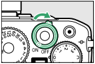

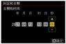

<!-- page 16 -->

## ⏰ 图标

拍摄显示中闪烁的 ⏰ 图标表示照相机时钟已被重设。新拍摄照片中记录的日期和时间将不正确；请使用设定菜单中的 **[时区和日期] > [日期和时间]** 选项将时钟设为正确的时间和日期。

照相机时钟由单独的时钟电池供电。当照相机中插有主电池时，时钟电池会充电。电池充满电需要大约 2 天。一旦充满电，其可为时钟供电约 1 个月。

---

开启照相机 →第116页
